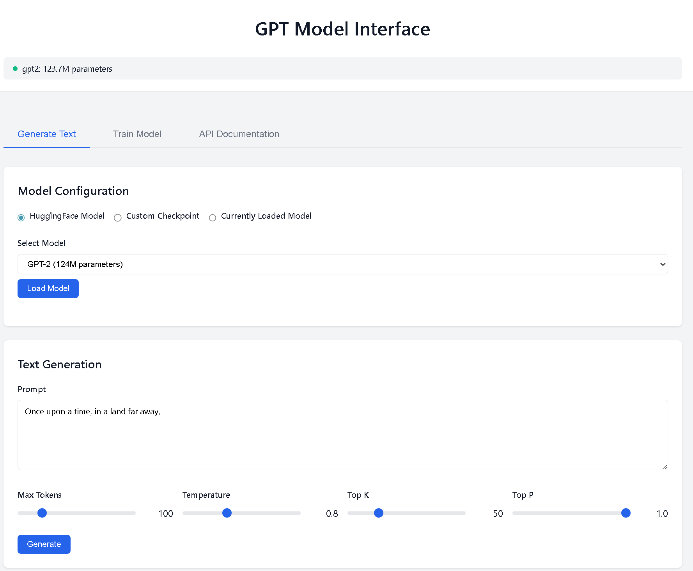
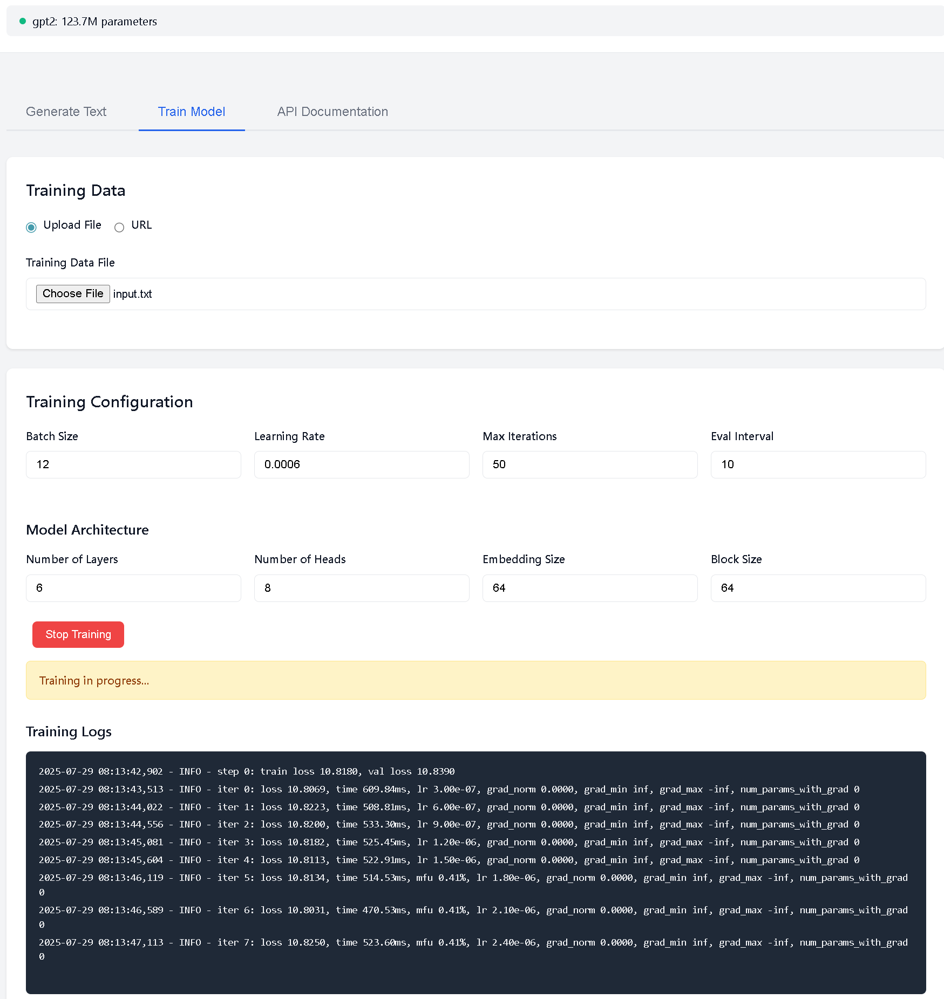
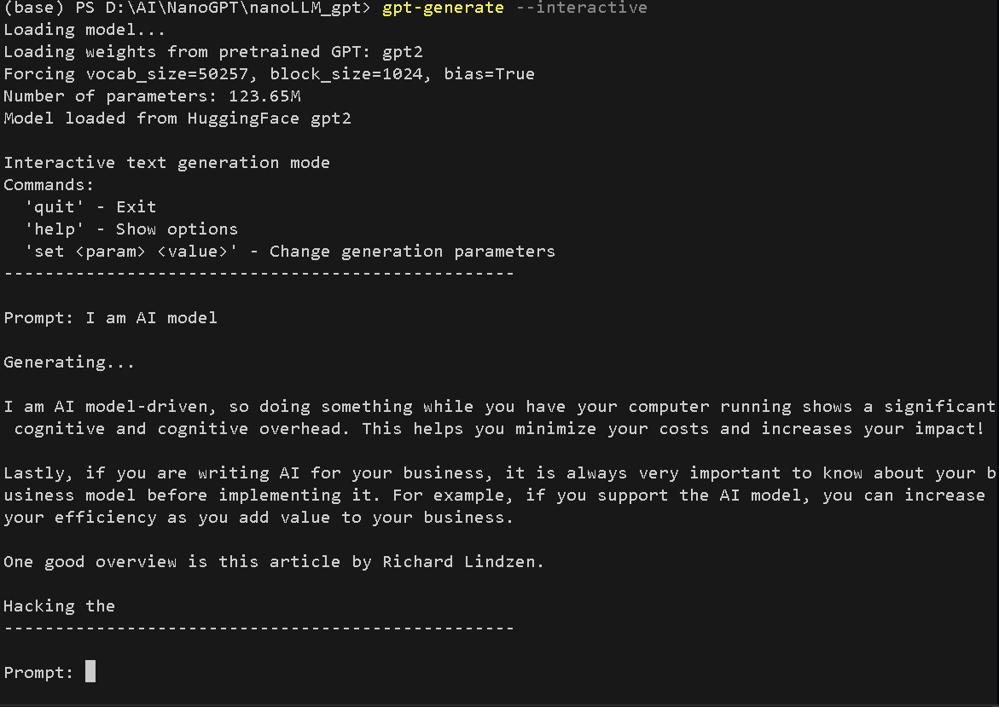

# nanoLLM_gpt

A clean, modular implementation of GPT (Generative Pre-trained Transformer) with support for training, fine-tuning, inference, and serving. This project provides a production-ready codebase with comprehensive documentation, following software engineering best practices.

**Note**: This project is built based on [karpathy/nanoGPT](https://github.com/karpathy/nanoGPT/). The codebase has been refactored for modularity, extended with additional features, and enhanced with detailed documentation. So far, developing on the shoulders of giants, this particular repository was developed as a single person project to make it easy for me to create and test new LLM models. Parts of the code were created and reviewed using AI assistants (Claude, ChatGPT, Gemini), and tested manually and iteratively developed in cycles.

**Webserver to train and inference for a model and interactive terminals**







## Features

- **Modular Architecture**: Clean separation of concerns with dedicated modules for configuration, data handling, training, and inference
- **Unified Model Loading**: Consistent interface for loading models from checkpoints or HuggingFace
- **Flexible Training**: Support for single GPU, multi-GPU (DDP), and multi-node distributed training with mixed precision
- **Multiple Interfaces**: REST API, web UI, and command-line tools
- **OpenAI-Compatible API**: Drop-in replacement for OpenAI API clients
- **Configuration Management**: YAML/JSON configuration files with command-line overrides
- **Comprehensive Logging**: Integration with Weights & Biases and file-based logging
- **Extensive Documentation**: Detailed docstrings, function flow diagrams, and technical handbook
- **Production Ready**: Error handling, validation, and performance optimizations
- **Testing Suite**: Unit tests and integration tests with pytest

Refer to **[Technical Handbook](handbook.md)** for comprehensive technical reference.

## Installation

### Prerequisites

- Python 3.8 or higher
- PyTorch 2.0 or higher (for Flash Attention support)
- CUDA-capable GPU (recommended) or CPU

### From Source

```bash
# Clone the repository
git clone https://github.com/MalayMDas/nanoLLM_gpt.git
cd nanoLLM_gpt

# Create a new python virtual environment
python3 -m venv .venv

#Activate the virtual environment
source .venv/bin/activate

# Install in development mode
pip install -e .
```

### Development Setup

```bash
# Install all development dependencies
pip install -e ".[dev,datasets,wandb]"

# Run tests to verify installation
pytest
```

## Quick Start

### 1. Generate Text

Using the command-line interface:

```bash
# Generate from HuggingFace model
gpt-generate --model gpt2 --prompt "Once upon a time"

# Generate from checkpoint
gpt-generate --checkpoint out/ckpt.pt --prompt "The future of AI"

# Interactive mode
gpt-generate --model gpt2 --interactive
```

### 2. Train a Model

```bash
# Train from scratch
gpt-train --data-path input.txt --max-iters 5000

# Train with configuration file
gpt-train --config config/train_config.yaml

# Resume training from checkpoint (auto-loads saved config. The data comes from uploads folder)
gpt-train --init-from resume --out-dir models/my_model

# Resume training with new data
gpt-train --init-from resume --out-dir models/my_model --data-path new_data.txt

# Fine-tune pretrained model (auto-creates model directory)
gpt-train --init-from gpt2 --data-path domain_data.txt
# Creates: out_gpt2/ckpt.pt and out_gpt2/config.yaml

# Fine-tune with custom model directory
gpt-train --init-from gpt2-medium --data-path domain_data.txt \
  --out-dir models/finetuned/gpt2_medical --learning-rate 3e-5

# Multi-GPU training (single node)
torchrun --nproc_per_node=4 -m nanoLLM_gpt.train --config config/train_config.yaml

# Multi-node training (2 nodes with 8 GPUs each)
# On master node:
torchrun --nproc_per_node=8 --nnodes=2 --node_rank=0 \
  --master_addr=192.168.1.100 --master_port=29500 \
  -m nanoLLM_gpt.train --config config/train_config.yaml

# On worker node:
torchrun --nproc_per_node=8 --nnodes=2 --node_rank=1 \
  --master_addr=192.168.1.100 --master_port=29500 \
  -m nanoLLM_gpt.train --config config/train_config.yaml
```

### 3. Start the Server

```bash
# Start with default configuration
gpt-server

# Start with custom configuration
gpt-server --config config/server_config.yaml

# Start with specific model
gpt-server --checkpoint out/ckpt.pt --port 8080
```

### 4. Running provided examples

```bash
# Runs provided example code
python examples/basic_usage.py
```

### 5. Fine-tuning HuggingFace Models

The web interface now supports fine-tuning pre-trained HuggingFace models:

1. Start the server: `gpt-server`
2. Navigate to the "Train Model" tab
3. Select "Fine-tune HuggingFace Model"
4. Choose a model (GPT-2, GPT-2 Medium, Large, or XL)
5. Upload your domain-specific training data
6. Configure training parameters
7. Start training

Fine-tuned models will be saved to `out_<model_name>` (e.g., `out_gpt2-medium`)
## Configuration

### Training Configuration

Create a `train_config.yaml` file:

```yaml
model:
  n_layer: 12
  n_head: 12
  n_embd: 768
  block_size: 1024

data_path: path/to/data.txt
max_iters: 100000
learning_rate: 6.0e-4
batch_size: 12

# Distributed training settings (optional)
backend: nccl  # nccl for GPU, gloo for CPU
# These are typically set via torchrun, but can be configured here
# nproc_per_node: 4
# nnodes: 1
# master_addr: localhost
# master_port: 29500
```

### Server Configuration

Create a `server_config.yaml` file:

```yaml
host: 0.0.0.0
port: 8080
model_type: gpt2
device: cuda
dtype: auto
```

## Model Directory Organization

The project uses a **Model Directory** approach for organizing trained models. Each model directory contains both the checkpoint (`ckpt.pt`) and configuration (`config.yaml`) files together, making model management simpler and more organized.

### Using Model Directories

#### Training with Custom Directory
```bash
# Specify a custom model directory for organization
gpt-train --data-path data.txt --out-dir models/experiments/run_001

# The model will be saved to:
# - models/experiments/run_001/ckpt.pt
# - models/experiments/run_001/config.yaml
```

#### Loading from Model Directory
```python
from nanoLLM_gpt.utils import InferencePipeline

pipeline = InferencePipeline()
# Load using model directory - both files are found automatically
pipeline.load_model(
    checkpoint_path='models/production/v1.0/ckpt.pt',
    config_path='models/production/v1.0/config.yaml'
)
```

#### Web Interface
- **Train Model Tab**: The "Model Directory" field specifies where to save outputs
- **Generate Text Tab**: Enter the model directory path to load both checkpoint and config

### Automatic Directory Naming

When fine-tuning HuggingFace models, directories are automatically named:
- `gpt2` → `out_gpt2/`
- `gpt2-medium` → `out_gpt2-medium/`
- `gpt2-large` → `out_gpt2-large/`
- `gpt2-xl` → `out_gpt2-xl/`

## API Usage

The server provides an OpenAI-compatible API:

### Python Example

```python
from openai import OpenAI

client = OpenAI(
    base_url="http://localhost:8080/v1",
    api_key="not-needed"
)

# Chat completion
response = client.chat.completions.create(
    model="gpt",
    messages=[
        {"role": "system", "content": "You are a helpful assistant."},
        {"role": "user", "content": "Write a haiku about programming."}
    ]
)

# Text completion
response = client.completions.create(
    model="gpt",
    prompt="Once upon a time",
    max_tokens=100,
    temperature=0.8
)
```

### Curl Example

```bash
curl http://localhost:8080/v1/chat/completions \
  -H "Content-Type: application/json" \
  -d '{
    "model": "gpt",
    "messages": [{"role": "user", "content": "Hello!"}],
    "temperature": 0.8,
    "max_tokens": 100
  }'
```

## Web Interface

Access the web interface at `http://localhost:8080` after starting the server. 

### Features

- **Text Generation**: Interactive text generation with adjustable parameters
  - Load models from HuggingFace or custom Model Directories
  - Single "Model Directory" field for easy model loading
  - Real-time generation with customizable parameters
  
- **Model Training**: Start and monitor training jobs
  - **Model Directory** field for organized output storage
  - Three training modes:
    - New Training: Train from scratch with custom directory
    - Resume Training: Continue from existing model directory
    - Fine-tune HuggingFace: Auto-generates directories like `out_gpt2`
  - Real-time training logs and status updates
  - Support for distributed training (DDP)
  
- **API Documentation**: Built-in API reference with examples

## Advanced Usage

### Custom Data Preparation

```python
from nanoLLM_gpt.utils import DataPreparer

preparer = DataPreparer()
data_dir = preparer.prepare_data(
    data_path="https://example.com/data.txt",
    train_val_split=0.001
)
```

### Programmatic Model Loading

```python
from nanoLLM_gpt.utils import ModelLoader

# Load from checkpoint
model = ModelLoader.load_model(
    checkpoint_path="out/ckpt.pt",
    device="cuda",
    compile=True
)

# Load from HuggingFace
model = ModelLoader.load_model(
    model_type="gpt2-large",
    device="cuda"
)
```

### Custom Inference Pipeline

```python
from nanoLLM_gpt.utils import InferencePipeline
from nanoLLM_gpt.config import GenerationConfig

# Initialize pipeline
pipeline = InferencePipeline(device="cuda")
pipeline.load_model(model_type="gpt2")

# Generate with custom config
config = GenerationConfig(
    max_new_tokens=200,
    temperature=0.9,
    top_p=0.95
)

text = pipeline.generate("Once upon a time", config)
```

## Development

### Running Tests

```bash
pytest tests/
```


## Project Structure

**nanoLLM_gpt** folder has the code to build model and train it and derrive inference from it.

```
nanoLLM_gpt
├── nanoLLM_gpt/
|   ├── __init__.py             # Package initialization and public API exports
|   │                           # Exports: GPT, GPTConfig, ModelConfig, TrainingConfig, 
|   │                           #         GenerationConfig, APIConfig
|   ├── model.py                # GPT model implementation (transformer architecture)
|   │                           # Classes: GPT, Block, CausalSelfAttention, MLP, LayerNorm
|   │                           # Key features: Flash Attention support, weight tying,
|   │                           #              HuggingFace compatibility
|   ├── config.py               # Configuration dataclasses and utilities
|   │                           # Classes: ModelConfig, TrainingConfig, GenerationConfig,
|   │                           #         APIConfig, ChatMessage, ConfigLoader
|   │                           # Features: YAML/JSON support, CLI argument parsing
|   ├── train.py                # Training script with distributed support
|   │                           # Class: Trainer
|   │                           # Features: DDP/FSDP support, mixed precision, 
|   │                           #          gradient accumulation, checkpointing
|   ├── generate.py             # Text generation CLI with interactive mode
|   │                           # Features: Interactive REPL, batch generation,
|   │                           #          streaming output, prompt files
|   ├── server.py               # Unified API and web server
|   │                           # Classes: TrainingManager
|   │                           # Endpoints: /v1/chat/completions, /v1/completions,
|   │                           #           /v1/models, web UI routes
|   │                           # Features: OpenAI-compatible API, training management
|   ├── utils/                  # Utility modules
|   │   ├── __init__.py         # Utils package initialization
|   │   ├── model_loader.py     # Centralized model loading and management
|   │   │                       # Class: ModelLoader
|   │   │                       # Features: Checkpoint/HuggingFace loading,
|   │   │                       #          device management, compilation support
|   │   ├── data_utils.py       # Data preparation and loading utilities
|   │   │                       # Classes: DataPreparer, DataLoader
|   │   │                       # Features: URL/file loading, tokenization,
|   │   │                       #          train/val split, memory-mapped files
|   │   ├── training_utils.py   # Training utilities (LR scheduler, logging)
|   │   │                       # Classes: LearningRateScheduler, TrainingLogger
|   │   │                       # Features: Cosine decay with warmup, W&B integration,
|   │   │                       #          gradient statistics, checkpoint tracking
|   │   └── inference.py        # Unified inference pipeline
|   │                           # Class: InferencePipeline
|   │                           # Features: Top-p/top-k sampling, streaming,
|   │                           #          batch generation, chat formatting
|   ├── templates/              # Web UI templates
|      └── index.html           # Web interface with training/generation UI
|                               # Features: Interactive text generation,
|                               #          training configuration and monitoring,
|                               #          API documentation and examples|  
|   
├── tests/                      # Test suite
|   ├── __init__.py             # Test package initialization
|   ├── test_comprehensive.py   # Comprehensive functionality tests
|   │                           # Coverage: All major components and workflows
|   ├── test_edge_cases.py      # Edge case and error handling tests
|   │                           # Coverage: Boundary conditions, invalid inputs
|   ├── test_model_loader.py    # Model loading specific tests
|   │                           # Coverage: Checkpoint/HF loading, device handling
|   └── integration_tests/      # Integration tests (require running server)
|       ├── __init__.py         # Integration test package
|       └── test_api.py         # API endpoint integration tests
|                               # Coverage: REST API, streaming, chat format
├── handbook.md                 # Technical handbook with detailed documentation
│                               # Contents: Architecture overview, function flows,
│                               #          configuration reference, usage guide,
│                               #          extension guide, troubleshooting
├── setup.py                    # Package setup and installation configuration
│                               # Entry points: gpt-train, gpt-generate, gpt-server
│                               # Optional deps: dev, datasets, wandb
├── requirements.txt            # Core dependencies
│                               # Core: torch, numpy, tiktoken, flask, pyyaml
├── pyproject.toml              # Modern Python packaging configuration
│                               # Build system: setuptools
├── Makefile                    # Development automation
│                               # Targets: install, test, format, lint, clean
├── .gitignore                  # Git ignore patterns
│                               # Ignores: __pycache__, *.pyc, out/, logs/, etc.
└── LICENSE                     # MIT License file

Additional Files (when created):
├── config/                     # Configuration examples directory
│   ├── train_config.yaml       # Example training configuration
│   ├── server_config.yaml      # Example server configuration
│   └── generation_config.yaml  # Example generation configuration
├── data/                       # Data directory (auto-created)
│   └── <dataset_name>/         # Tokenized data for each dataset
│       ├── train.bin           # Training data (memory-mapped)
│       └── val.bin             # Validation data (memory-mapped)
├── out/                        # Output directory (auto-created during training)
│   ├── ckpt.pt                 # Latest checkpoint
│   ├── best_ckpt.pt            # Best validation checkpoint
│   └── training.log            # Training logs
└── logs/                       # Server logs directory (auto-created)
    └── server.log              # API server logs
```


## Model Architecture

The implementation supports various GPT-2 model sizes:

| Model | Layers | Heads | Embedding Size | Parameters | Context Length |
|-------|--------|-------|----------------|------------|----------------|
| gpt2 | 12 | 12 | 768 | 124M | 1024 |
| gpt2-medium | 24 | 16 | 1024 | 350M | 1024 |
| gpt2-large | 36 | 20 | 1280 | 774M | 1024 |
| gpt2-xl | 48 | 25 | 1600 | 1558M | 1024 |

### Custom Model Sizes

You can create custom model configurations:

```yaml
# config/small_model.yaml
model:
  n_layer: 6          # Number of transformer blocks
  n_head: 8           # Number of attention heads
  n_embd: 512         # Embedding dimension
  block_size: 512     # Maximum sequence length
  vocab_size: 50304   # Vocabulary size (padded for efficiency)
  dropout: 0.1        # Dropout for training
  bias: false         # Disable bias for better performance
```

### Architecture Details

- **Attention**: Multi-head causal self-attention with Flash Attention support
- **FFN**: 4x expansion with GELU activation
- **Normalization**: Pre-normalization with LayerNorm
- **Position Encoding**: Learned positional embeddings
- **Weight Tying**: Input and output embeddings are tied

## Performance Tips

1. **Hardware Optimization**
   - Use PyTorch 2.0+ for Flash Attention support
   - Enable model compilation with `--compile` flag (~30% speedup)
   - Use Ampere or newer GPUs for best performance
   - Enable TF32 for matrix multiplications (automatic on supported hardware)

2. **Memory Optimization**
   - Use mixed precision training with `dtype: bfloat16` (recommended) or `float16`
   - Adjust batch size and gradient accumulation for your GPU memory
   - Use gradient checkpointing for very large models (if implemented)
   - Clear GPU cache periodically: `torch.cuda.empty_cache()`

3. **Training Optimization**
   - Use distributed training for large models:
     - Single node: `torchrun --nproc_per_node=4 -m nanoLLM_gpt.train`
     - Multi-node: See [Distributed Training](#distributed-training) section
   - Enable data loading optimizations with pinned memory
   - Adjust `num_workers` for data loading based on CPU cores
   - Use larger batch sizes with gradient accumulation for stability
   - Consider gradient accumulation for effective larger batch sizes

4. **Inference Optimization**
   - Compile models for inference: `model = torch.compile(model)`
   - Use appropriate precision: `bfloat16` for quality, `int8` for speed
   - Implement key-value caching for longer sequences
   - Batch multiple requests together when possible

## Common Use Cases

### 1. Fine-tuning on Custom Data

```bash
# Prepare your data
echo "Your custom training text" > data.txt

# Fine-tune from GPT-2
gpt-train --init-from gpt2 --data-path data.txt \
  --max-iters 10000 --learning-rate 3e-5 \
  --eval-interval 500 --eval-iters 50
```

### 2. Running a Local ChatGPT-like Service

```bash
# Start server with GPT-2 Large
gpt-server --model-type gpt2-large --port 8080

# Use with OpenAI Python client
from openai import OpenAI
client = OpenAI(base_url="http://localhost:8080/v1", api_key="dummy")
response = client.chat.completions.create(
    model="gpt",
    messages=[{"role": "user", "content": "Hello!"}]
)
```

### 3. Resume Training and Model Loading

#### Resume Training with Model Directories

```bash
# Resume from model directory - automatically loads config.yaml
gpt-train --init-from resume --out-dir models/my_experiment

# Resume with different hyperparameters (overrides saved config)
gpt-train --init-from resume --out-dir models/my_experiment \
  --learning-rate 1e-4 --max-iters 10000

# Resume with new training data
gpt-train --init-from resume --out-dir models/my_experiment \
  --data-path new_corpus.txt

# Fine-tune HuggingFace model with automatic directory
gpt-train --init-from gpt2-medium --data-path custom_data.txt
# Creates: out_gpt2-medium/ckpt.pt and out_gpt2-medium/config.yaml
```

#### Loading Models in Web Interface

The web interface has been updated with Model Directory support:

**Train Model Tab:**
- **Model Directory**: Unified field for specifying where to save checkpoint and config
- Automatically updates based on training mode:
  - New Training: Customizable, defaults to "out"
  - Resume Training: Locked to checkpoint directory
  - Fine-tune HuggingFace: Auto-generates like "out_gpt2-medium"

**Generate Text Tab:**
- **Model Directory**: Single field to specify directory containing both files
- Example: Enter `models/production/v1.0` to load:
  - `models/production/v1.0/ckpt.pt`
  - `models/production/v1.0/config.yaml`

### 4. Batch Text Generation

```python
from nanoLLM_gpt.utils import InferencePipeline
from nanoLLM_gpt.config import GenerationConfig

pipeline = InferencePipeline()
pipeline.load_model(model_type="gpt2")

# Generate multiple samples
config = GenerationConfig(num_samples=5, temperature=0.9)
samples = pipeline.generate("The future of AI is", config)
for i, sample in enumerate(samples):
    print(f"Sample {i+1}: {sample}")
```

## Troubleshooting

### CUDA Out of Memory

- Reduce `batch_size` in configuration
- Increase `gradient_accumulation_steps`
- Use a smaller model variant
- Enable gradient checkpointing (if implemented)
- Use mixed precision: `--dtype float16` or `--dtype bfloat16`

### Slow Training

- Ensure you're using GPU: `--device cuda`
- Enable mixed precision: `--dtype bfloat16`
- Use model compilation: `--compile` (requires PyTorch 2.0+)
- Check data loading isn't bottleneck
- Use larger batch sizes with gradient accumulation

### API Connection Issues

- Verify server is running: `curl http://localhost:8080/health`
- Check firewall settings
- Ensure correct `base_url` in client configuration
- For CORS issues, check `cors_enabled` in server config

### Import Errors

- Ensure package is installed: `pip install -e .`
- Check Python path includes the project directory
- Verify all dependencies are installed: `pip install -r requirements.txt`

## Distributed Training

### Multi-GPU Training (Single Node)

For training on multiple GPUs on a single machine:

```bash
# Train on 4 GPUs
torchrun --nproc_per_node=4 -m nanoLLM_gpt.train \
  --data-path data.txt --out-dir out_multi_gpu

# With configuration file
torchrun --nproc_per_node=4 -m nanoLLM_gpt.train \
  --config config/train_config.yaml
```

### Multi-Node Training

For distributed training across multiple machines:

```bash
# On master node (node rank 0)
torchrun --nproc_per_node=8 --nnodes=2 --node_rank=0 \
  --master_addr=192.168.1.100 --master_port=29500 \
  -m nanoLLM_gpt.train --config config/train_config.yaml

# On worker node (node rank 1)
torchrun --nproc_per_node=8 --nnodes=2 --node_rank=1 \
  --master_addr=192.168.1.100 --master_port=29500 \
  -m nanoLLM_gpt.train --config config/train_config.yaml
```

### SLURM Cluster

For SLURM-managed clusters:

```bash
#!/bin/bash
#SBATCH --job-name=gpt_training
#SBATCH --nodes=2
#SBATCH --gpus-per-node=8
#SBATCH --ntasks-per-node=8

srun torchrun \
  --nproc_per_node=$SLURM_GPUS_PER_NODE \
  --nnodes=$SLURM_NNODES \
  --node_rank=$SLURM_NODEID \
  --master_addr=$(scontrol show hostnames $SLURM_JOB_NODELIST | head -n 1) \
  --master_port=29500 \
  -m nanoLLM_gpt.train --config config/train_config.yaml
```

### Web Interface DDP Support

The web interface includes distributed training support:
1. Navigate to "Train Model" tab
2. Enable "Distributed Training" section
3. Configure:
   - Backend (NCCL for GPU, Gloo for CPU)
   - Number of processes per node
   - Number of nodes (for multi-node)
   - Master address and port

### Important Notes for Distributed Training

- **Effective Batch Size**: `batch_size × gradient_accumulation_steps × world_size`
- **Learning Rate Scaling**: Consider scaling learning rate with world size
- **Data Sharding**: Each process automatically loads its own data shard
- **Checkpointing**: Only the master process (rank 0) saves checkpoints
- **Backend Selection**: Use NCCL for GPUs (much faster than Gloo)
- **Environment**: Ensure all nodes have identical environment and code
- **Network**: For multi-node, ensure network connectivity between nodes
- **Debugging**: Set `NCCL_DEBUG=INFO` for debugging distributed issues

## Testing

The project includes comprehensive tests:

```bash
# Run all unit tests
pytest tests/

# Run specific test file
pytest tests/test_model_loader.py

# Run with coverage report
pytest --cov=nanoLLM_gpt tests/

# Run integration tests (requires running server)
python -m pytest tests/integration_tests/
```

## License

This project is licensed under the MIT License - see the [LICENSE](LICENSE) file for details.

## Documentation

- **[Technical Handbook](handbook.md)**: Comprehensive technical reference with:
  - Architecture overview and design decisions
  - Detailed function flow diagrams for training and inference
  - Complete function reference table with inputs/outputs
  - Python concepts explained for beginners
  
- **API Documentation**: Available at `/api` endpoint when server is running
- **Code Documentation**: Extensive docstrings in all modules


## Acknowledgments

- Based on the GPT architecture from OpenAI
- Developed based on [karpathy/nanoGPT](https://github.com/karpathy/nanoGPT/) - Andrej's code was the starting point of this repository
- The codebase has been significantly refactored for modularity and extended with additional features
- Parts of the code were created and reviewed using LLMs (Claude, ChatGPT, Gemini) and then further developed and tested manually in cycles.
- Uses HuggingFace Transformers for pretrained weights
- Uses tiktoken for GPT-2 compatible tokenization

